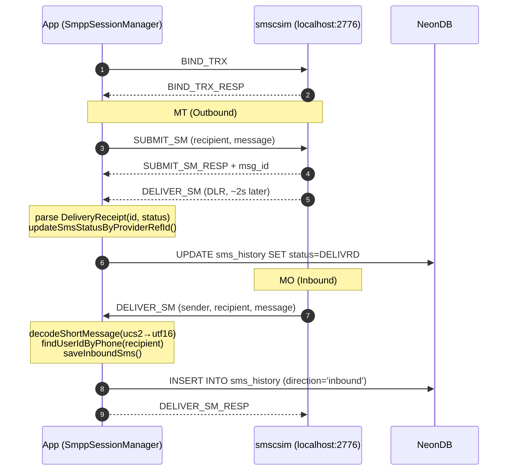
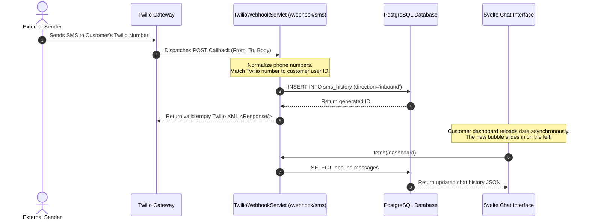

# Twilio-SMS-Client

<p align="center">
  
  
  
  
  
  
  
  
</p>

Dual-provider SMS platform — **Twilio** and **SMPP** with per-user provider routing, real-time internal chat, admin broadcast, and profile-based environment configuration.

## Architecture

```
frontend/                          → Svelte 5 SPA (Vite + Tailwind v4)
src/main/java/.../                 → Jakarta EE 10 servlets (JSON REST)
├── SmppSessionManager             → SMPP session pool (jsmpp)
├── SmppSmsProvider                → SMPP send wrapper
├── SmpEventLogger                 → SMPP event DB logger
├── TwilioSmsProvider              → Twilio REST API wrapper
├── TwilioSmsService               → Twilio for registration (separate creds)
├── SmsRouter                      → Provider dispatch: TWILIO|SMPP|AUTO
├── UserRepository                 → JDBC DAO (HikariCP pool)
├── ChatWebSocket                  → Real-time internal chat (JSR 356)
├── DBUtil                         → HikariCP + Flyway migrations
├── EnvLoader                      → Profile-based env resolution
├── LoginServlet / AuthFilter      → Session auth (BCrypt)
├── RegisterServlet / VerifyMsisdnServlet  → MSISDN verification
├── SendSmsServlet / DeleteSmsServlet      → SMS CRUD
├── DashboardServlet / ProfileServlet      → User data
├── TwilioWebhookServlet           → Inbound SMS callback
├── Admin*Servlet                  → Admin console
├── AdminLogServlet                → GET /admin/smpp-logs
├── WiresharkServlet               → POST/GET /admin/wireshark/*
└── SpaFilter                      → SPA routing fallback
NeonDB                             → PostgreSQL (Flyway V1–V6)
smscsim (Docker)                   → Local SMPP SMSC simulator
```

## Quick Start

### Prerequisites

- Java 21+, Maven, Node 22+
- Podman (or Docker) for SMPP simulator
- PostgreSQL (NeonDB or local)

### Single Terminal (Quickest)

```bash
# 1. Start SMPP simulator
podman-compose up -d smscsim

# 2. Configure .env (edit with your DB creds, set APP_PROFILE=local)
cp .env.example .env

# 3. Build frontend
cd frontend && npm install && npm run build && cd ..

# 4. Start server
mvn jetty:run
```

Open http://localhost:8080. Requires rebuild + restart on frontend changes.

### Multi-Terminal (Hot-Reload, Recommended for Dev)

```bash
# Terminal 1: SMSC simulator
podman-compose up -d smscsim

# Terminal 2: Frontend dev server (hot-reload on .svelte changes)
cd frontend && npm install && npm run dev -- --host
# → http://localhost:5173, proxies API/WS to Jetty

# Terminal 3: Backend
mvn jetty:run
```

Edit `.svelte` files → browser auto-reloads in <1s. All API, WebSocket, and SMPP flows work identically.

### Docker (Full Stack, Production-like)

```bash
podman-compose --env-file .env up -d
```

Set `APP_PROFILE=docker` in `.env` for container networking (`smscsim` hostname instead of `localhost`).

### IntelliJ IDEA (Debug Mode)

```bash
# Terminal: SMSC simulator
podman-compose up -d smscsim
```

In IntelliJ: **Run → Edit Configurations → + → Maven** → Command line: `jetty:run`. Debug for breakpoints on servlets, SMPP handlers, WebSocket code.

---

> **Full walkthrough** with architecture diagrams, code tours, and per-feature test cases in `ONBOARDING.md` (local-only doc, `.gitignore`d).

### Verification

```bash
# After `mvn jetty:run`, confirm the server is alive:
curl -s http://localhost:8080/login -X POST \
  -H "Content-Type: application/json" \
  -d '{"username":"admin","password":"123456"}'
# Expected: {"status":"success","role":"administrator"}
```

### Test Credentials

| User | Password | Role | Provider |
|------|----------|------|----------|
| `admin` | `123456` | administrator | — |
| `zkhattab` | `kh007` | customer | AUTO (SMPP → localhost:2776) |

## Features

### 1. Authentication & Session Management

| Feature | Endpoint | Detail |
|---------|----------|--------|
| Login | `POST /login` | JSON `{username, password}`. BCrypt verify. Rate-limited (5 attempts/min/IP). Creates HTTP session with `userId` + `role`. |
| Logout | `GET /logout` | `session.invalidate()`. |
| Register | `POST /register` | Full profile + Twilio creds. Sends 6-digit PIN via Twilio SMS. `PendingRegistration` in session (10-min TTL). |
| Verify MSISDN | `POST /verify-msisdn` | PIN match. OTP resend via `?action=resend`. Account creation on success. |
| AuthFilter | filter on `/dashboard`, `/profile`, `/admin/*` | 401 if unauthenticated, 403 if non-admin on `/admin/*`. |
| SpaFilter | `/*` | GET passthrough for API paths, else → `index.html` SPA fallback. |

### 2. Customer Dashboard

| Feature | Trigger | Backend | Behavior |
|---------|---------|---------|----------|
| SMS Chat | `GET /dashboard` every 5s | `DashboardServlet` | Conversation sidebar grouped by phone, sorted by latest message. Dual-tone bubbles with status icons (pending ✓, delivered ✓✓, failed ✗). |
| New Conversation | New Chat button | — | Enter phone number → creates active thread. |
| Send SMS | Submit on chat bar | `POST /send-sms` → `SmsRouter` | Routed by user's `sms_provider`. Recorded to `sms_history`. |
| Delete Message | Trash icon per bubble | `POST /delete-sms` | Confirmation dialog. User-scoped delete. |
| Internal Chat | Internal tab | WS `/ws/chat` + `GET /api/chat/*` | Real-time user-to-user, server push, user list, history, read tracking, unread badge. |
| System Messages | System tab | `GET /api/chat/system` | Admin broadcasts, read tracking via `system_message_reads`. |
| Profile Settings | Edit Profile button | `GET/POST /profile` | Account Info + Twilio creds + SMS Provider config (TWILIO/SMPP/AUTO + SMSC details). |

### 3. Admin Console

| Feature | Trigger | Backend | Behavior |
|---------|---------|---------|----------|
| Metric Cards | on load | `GET /admin/dashboard` | Active Accounts + Total Outbound SMS counters. |
| Customer Directory | on load | `GET /admin/dashboard` | Table with Edit/SMS/Delete per row. |
| Create Customer | Create button | `POST /admin/customer` (actionType=create) | Empty form. Bypasses PIN flow. Full profile + SMPP config. E.164 validation. |
| Edit Customer | Edit per row | `GET /admin/customer?id=N` → `POST` save | Conditional partial update. |
| Delete Customer | Delete per row | `POST /admin/customer` (actionType=delete) | Confirmation dialog. |
| SMS History | SMS per row | `GET /admin/customer?id=N&action=sms_history` | Merged outbound+inbound, sorted by time, colored badges. |
| Broadcast | Broadcast button | `POST /admin/broadcast` | System message + optional real SMS via each user's provider. WebSocket push. |
| Broadcasts History | 30s refresh | `GET /api/chat/system?limit=100` | Scrollable list with timestamps. |
| SMPP Logs | SMPP Logs modal | `GET /admin/smpp-logs` every 3s | See #7 below. |
| Wireshark | Wireshark modal | `POST/GET /admin/wireshark/*` | See #6 below. |

### 4. SMS Providers & Routing

`SmsRouter` dispatches per user's `sms_provider`. See [full routing detail](#provider-routing).

### 5. SMPP Session Management

`SmppSessionManager` pool keyed by `host:port:systemId` (`ConcurrentHashMap`).

- **Reuse** — returns existing session if `isBound()`, rebinds if closed
- **Keepalive** — `setEnquireLinkTimer(30000)`, `setTransactionTimer(10000)`
- **State listener** — auto-removes from pool on `CLOSED`, logs warning
- **DLR** — `DELIVER_SM` with `esmClass==4` → `DeliveryReceipt` parser → `updateSmsStatusByProviderRefId()`
- **MO** — `DELIVER_SM` inbound → `decodeShortMessage()` (UTF-8/UTF-16BE via `dataCoding`) → `findUserIdByPhone()` → `saveInboundSms()`
- **Shutdown** — `closeAll()` unbinds all pooled sessions

### 6. Wireshark Packet Capture (Admin)

Live SMPP packet capture from browser via `dumpcap` + `tshark`.

| Action | Endpoint | Detail |
|--------|----------|--------|
| Start | `POST /admin/wireshark/start` | `sg wireshark -c "dumpcap -i lo -f \"port 2776\" -w /tmp/smpp_capture.pcap -P"`. Singleton (rejects if running). Deletes old PCAP. |
| Stop | `POST /admin/wireshark/stop` | `process.destroyForcibly()`. Returns duration + fileSize. |
| Status | `GET /admin/wireshark/status` | `{running, fileExists, durationSec, packetCount, fileSize}` |
| Packets | `GET /admin/wireshark/packets` | `tshark -r <pcap> -T json` → parses frame/IP/SMPP layers → simplified JSON array. SMPP commands decoded from hex to names (BIND_TRX, SUBMIT_SM, etc). Message truncated to 80 chars. |
| Download | `GET /admin/wireshark/download` | Serves PCAP as `application/vnd.tcpdump.pcap`. |

**Permission**: user in `wireshark` group, `sg wireshark` for privilege escalation. Admin role enforced at servlet level.

### 7. SMPP Event Logging

Persistent SMPP events — in-memory buffer + `smpp_event_logs` DB table (V6).

| Aspect | Detail |
|--------|--------|
| Buffer | `synchronizedList`, max 500 entries, oldest evicted |
| Endpoint | `GET /admin/smpp-logs` — JSON array, newest-first, `{timestamp, level, event, detail}` |
| Sources | BIND, UNBIND, SUBMIT_SM, DELIVER_SM, DLR, MO, ENQUIRE_LINK, ERROR |
| Frontend | 3s auto-refresh when modal open. Color-coded (ERROR=red, WARN=yellow, INFO=green). |
| Persistence | Also written to `smpp_event_logs` table — survives restarts |

### 8. Internal Chat & Broadcasts

| Aspect | Detail |
|--------|--------|
| WebSocket | `/ws/chat` (JSR 356). Authed via HTTP session in handshake. `pushToUser(userId, json)` server push. Per-user `ConcurrentHashMap<Integer, Set<Session>>`. |
| REST API | `POST /api/chat/send`, `GET /api/chat/history?with=X&before=Y&limit=Z`, `GET /api/chat/users`, `GET /api/chat/unread`, `GET /api/chat/system` |
| Unread | `read_at` on `internal_messages`. `last_read_id` upsert on `system_message_reads`. Polled every 10s. Badge on tab button. |
| Broadcast | `POST /admin/broadcast` → `system_messages` insert → WebSocket push → optional real SMS |
| Self-msg guard | Server rejects `recipientId == userId` |

### 9. Inbound SMS (MO)

| Source | Handler | Detail |
|--------|---------|--------|
| SMPP | `SmppSessionManager.MessageReceiverListener` | `DELIVER_SM` (esmClass != 4). `findUserIdByPhone()` → `saveInboundSms()`. |
| Twilio | `POST /webhook/sms` | Optional `X-Twilio-Signature` validation. Matches Twilio number to user. Returns TwiML `<Response/>`. |

### 10. Database Migrations

Flyway auto-migration on startup. See [full migration detail](#database-migrations-flyway).

### 11. Security Model

See [full security model](#security-model).

### 12. Technology Stack

| Component | Version | Role |
|-----------|---------|------|
| Java | 21 | Language |
| Jakarta EE | 10 | Servlet 6.1, WebSocket 2.1 |
| Jetty Maven Plugin | 11.0.20 | Server (`mvn jetty:run`) |
| PostgreSQL | 16 | Database (NeonDB) |
| HikariCP | 7.0.2 | Pool (max 3) |
| Flyway | 10.22.0 | Schema versioning |
| JSMPP | 3.0.2 | SMPP protocol |
| Twilio SDK | 9.2.0 | Twilio REST API |
| Gson | 2.10.1 | JSON |
| jbcrypt | 0.4 | Password hashing |
| dotenv-java | 3.0.0 | `.env` loading |
| SLF4J Simple | 2.0.16 | Logging |
| Svelte | 5 | Frontend SPA |
| Tailwind CSS | 4 | CSS framework |
| Vite | latest | Build + HMR (:5173) |

## Provider Routing

Each user has a `sms_provider` column: `TWILIO`, `SMPP`, or `AUTO`. Null defaults to `TWILIO`.

- **SMPP** → `SmppSessionManager.submit()` against user's SMPP config (or env fallback)
- **TWILIO** → `TwilioSmsProvider.send()` with user's Twilio creds
- **AUTO** → try SMPP first, fallback to Twilio on failure

## SMPP Development

[ukarim/smscsim](https://github.com/ukarim/smscsim) — local SMSC simulator. Zero auth, accepts any credentials.

| Port | Purpose |
|------|---------|
| 2776 | SMPP (host → container 2775) |
| 12775 | Web UI for MO simulation |

We use a custom image (`localhost/smscsim-fixed`). Upstream had a PDU bug — `service_type` field in DELIVER_SM was `"smscsim"` (7 chars, SMPP max is 5). jsmpp rejects it, so `onAcceptDeliverSm` is never called. Fix: empty service_type.

Rebuild instructions if upstream updates:

```bash
git clone https://github.com/ukarim/smscsim.git /tmp/smscsim
# smsc.go: change 'buf.WriteString("smscsim")' → 'buf.WriteByte(0)'
CGO_ENABLED=0 go build -o smscsim-static .
podman build -t localhost/smscsim-fixed .
```

### SMPP Flow



### DLR (Delivery Receipts)

Returned ~2s after SUBMIT_SM when `registered_delivery=1`. jsmpp `DeliveryReceipt` parser extracts message ID and final status (`DELIVRD`/`UNDELIV`). Status mapped to `message_status` enum and written to `sms_history.provider_ref_id` row.

## Inbound SMS Flow (Twilio)



### Sending MO via Web UI

```bash
curl -X POST http://localhost:12775/ \
  --data-urlencode "sender=+15551234567" \
  --data-urlencode "recipient=+201090702972" \
  --data-urlencode "message=Hello inbound!" \
  --data-urlencode "system_id=smppclient"
```

## Environment

| Variable | Profile | Purpose |
|----------|---------|---------|
| `APP_PROFILE` | both | `local` (host dev) or `docker` (container) |
| `DB_URL` | both | JDBC URL (use `sslmode=require` for NeonDB) |
| `DB_USER` | both | PostgreSQL user |
| `DB_PASSWORD` | both | PostgreSQL password |
| `LOCAL_SMPP_HOST` | local | `localhost` |
| `LOCAL_SMPP_PORT` | local | `2776` |
| `DOCKER_SMPP_HOST` | docker | `smscsim` (container name) |
| `DOCKER_SMPP_PORT` | docker | `2775` (internal container port) |
| `SMPP_SYSTEM_ID` | both | e.g. `smppclient` |
| `SMPP_PASSWORD` | both | e.g. `password` |
| `SMPP_ADDRESS_RANGE` | both | optional source address override |

`EnvLoader` resolves `LOCAL_` or `DOCKER_` prefix based on `APP_PROFILE`.

## Database Migrations (Flyway)

[Flyway](https://flywaydb.org/) is a schema version control tool. On every app startup, `DBUtil.contextInitialized()` obtains a `DataSource` from HikariCP and calls `Flyway.migrate()`. Flyway:

1. Reads the `flyway_schema_history` table in NeonDB (tracks which migrations are already applied + their checksums)
2. Scans migration files in `src/main/resources/db/migration/`, ordered by version number
3. Compares — already-applied migrations are skipped (checksum-verified to detect tampering)
4. Applies any new migrations in sequence
5. Records each successful migration in `flyway_schema_history`

**If a checksum mismatch occurs** (e.g., you edited an already-applied migration), Flyway errors on startup. Fix: create a new migration file instead of editing the old one, or if the old one truly needs replacing: `DELETE FROM flyway_schema_history WHERE version=N;` then restart.

**When to create a migration**: any schema change — add a table, add a column, create an enum. All migrations must be **additive only** (`ADD COLUMN IF NOT EXISTS`, `CREATE TABLE IF NOT EXISTS`). No destructive operations.

| File | Adds |
|------|------|
| `V1__database.sql` (baseline) | `users`, `sms_history`, message_status enum |
| `V2__user_role.sql` | user_role enum, role column |
| `V3__sms_provider.sql` | sms_provider + SMPP columns on users |
| `V4__internal_messages.sql` | Internal chat table |
| `V5__system_message_reads.sql` | Broadcast read tracking |
| `V6__add_smpp_event_logs.sql` | `smpp_event_logs` table |

Naming: `V{next_number}__{short_description}.sql`. Place in `src/main/resources/db/migration/`. `mvn jetty:run` → Flyway executes on startup.

## Security Model

| Layer | Mechanism |
|-------|-----------|
| Password storage | BCrypt (`jbcrypt`) |
| Session auth | HTTP session tracked by `AuthFilter`, cookie-based |
| Admin routes | `AuthFilter` checks `role=administrator`, returns 403 for non-admin |
| Rate limiting | Login: 5 req/min per IP (`ConcurrentHashMap`), returns 429 |
| WebSocket auth | Same HTTP session, validated on upgrade (`ChatWebSocket`) |
| Twilio webhook | Optional `X-Twilio-Signature` validation (if `TWILIO_AUTH_TOKEN` set) |
| SMS deletion | User-scoped: `DELETE FROM sms_history WHERE id=? AND user_id=?` |
| Duplicate prevention | `existsByUsernameEmailOrMsisdn()` on register/create |
| MSISDN format | E.164 enforced (`^\+\\d{5,15}$`) |


## API Endpoints

| Method | Path | Auth | Purpose |
|--------|------|------|---------|
| POST | `/login` | none | Session login (BCrypt, 5/min rate limit) |
| POST | `/logout` | none | Destroy session |
| POST | `/register` | none | Create account, send PIN via Twilio |
| POST | `/verify-msisdn` | none | Confirm phone via 6-digit PIN |
| GET | `/dashboard` | session | Profile + SMS history by conversation |
| POST | `/send-sms` | session | Send SMS (routed by sms_provider) |
| POST | `/delete-sms` | session | Delete SMS by id |
| GET/POST | `/profile` | session | View/update profile, change password |
| GET | `/admin/dashboard` | admin | Customer list + SMS stats |
| GET/POST | `/admin/customer` | admin | List/create/update customers |
| POST | `/admin/broadcast` | admin | Broadcast SMS to all customers |
| GET | `/api/chat/*` | session | Internal chat message history |
| WS | `/ws/chat` | session | Real-time internal chat |
| POST | `/webhook/sms` | none | Twilio inbound webhook callback |

## FAQ

**Q: Jetty starts but browser shows blank page or 404.**
A: You forgot to build the frontend. Run `cd frontend && npm install && npm run build && cd ..` then restart Jetty.

**Q: SMS sends but DLR never arrives (SMPP).**
A: smscsim container not running or wrong port. Check `podman ps | grep smscsim`. Default port is 2776 (host) → 2775 (container).

**Q: MO (inbound SMS) not appearing in DB.**
A: User's `msisdn` is NULL in the `users` table. Run `UPDATE users SET msisdn='+1234567890' WHERE id=N;` and try again.

**Q: SLF4J warnings about NOP logger on startup.**
A: Harmless. Jetty Maven Plugin isolates webapp classloader; `logback-classic` falls back to NOP. We use `slf4j-simple` — the warnings can be ignored.

**Q: Registration via `/register` fails with "Gateway execution error".**
A: Registration requires real Twilio credentials (sends a PIN SMS). Without them, it fails gracefully. Use the admin panel to create accounts instead.

**Q: Jetty kill command?**
A: `ps aux | grep "jetty:run" | awk '{print $2}' | xargs kill` — never use `lsof -ti:8080` (kills Firefox viewing the app).

## Project Structure

```
├── docker-compose.yml        # smscsim + app services
├── Dockerfile                # Multi-stage (Node 22 → Maven 21 → Jetty Runner)
├── database.sql              # V1 baseline schema (Flyway)
├── pom.xml                   # Jakarta 10, HikariCP, jsmpp, Flyway, jbcrypt
├── mvnw                      # Maven wrapper
├── frontend/
│   ├── src/lib/              # Svelte components
│   └── vite.config.js        # Build output → ../src/main/webapp/
├── src/main/
│   ├── java/.../twilio_project/   # Servlets, providers, DAO, utils
│   ├── resources/db/migration/    # Flyway V2–V6
│   └── webapp/               # Vite build target (static assets)
├── .env.example              # Template (safe to commit)
├── .env.local                # Local creds (gitignored)
├── .env.docker               # Docker-specific creds (gitignored)
└── .gitignore
```
