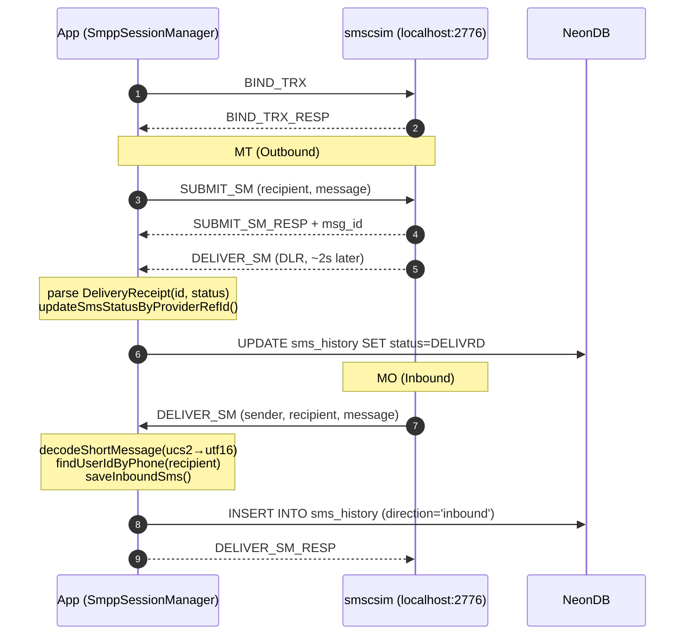
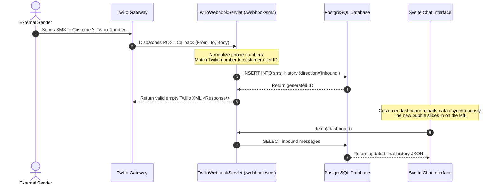

# Twilio-SMS-Client

<p align="center">
  
  
  
  
  
  
  
  
</p>

Dual-provider SMS platform — **Twilio** and **SMPP** with per-user provider routing, real-time internal chat, admin broadcast, and profile-based environment configuration.


## Architecture

```
frontend/                          → Svelte 5 SPA (Vite + Tailwind v4)
src/main/java/.../                 → Jakarta EE 10 servlets (JSON REST)
├── SmppSessionManager             → SMPP session pool (jsmpp)
├── SmppSmsProvider                → SMPP send wrapper
├── SmpEventLogger                 → SMPP event DB logger
├── TwilioSmsProvider              → Twilio REST API wrapper
├── TwilioSmsService               → Twilio for registration (separate creds)
├── SmsRouter                      → Provider dispatch: TWILIO|SMPP|AUTO
├── UserRepository                 → JDBC DAO (HikariCP pool)
├── ChatWebSocket                  → Real-time internal chat (JSR 356)
├── DBUtil                         → HikariCP + Flyway migrations
├── EnvLoader                      → Profile-based env resolution
├── LoginServlet / AuthFilter      → Session auth (BCrypt)
├── RegisterServlet / VerifyMsisdnServlet  → MSISDN verification
├── SendSmsServlet / DeleteSmsServlet      → SMS CRUD
├── DashboardServlet / ProfileServlet      → User data
├── TwilioWebhookServlet           → Inbound SMS callback
├── Admin*Servlet                  → Admin console
├── AdminLogServlet                → GET /admin/smpp-logs
├── WiresharkServlet               → POST/GET /admin/wireshark/*
└── SpaFilter                      → SPA routing fallback
NeonDB                             → PostgreSQL (Flyway V1–V6)
smscsim (Docker)                   → Local SMPP SMSC simulator
```

## Quick Start

### Prerequisites

- Java 21+, Maven, Node 22+
- Podman (or Docker) for SMPP simulator
- PostgreSQL (NeonDB or local)

### Local Dev

```bash
# 1. Start SMPP simulator
podman-compose up -d smscsim

# 2. Configure .env (edit with your DB creds, set APP_PROFILE=local)
cp .env.example .env

# 3. Build frontend
cd frontend && npm install && npm run build && cd ..

# 4. Start server
mvn jetty:run
```

Open http://localhost:8080

### Docker (full stack)

```bash
podman-compose --env-file .env up -d
```

Set `APP_PROFILE=docker` in `.env` for container networking.

### Test Credentials

| User | Password | Role | Provider |
|------|----------|------|----------|
| `admin` | `123456` | administrator | — |
| `zkhattab` | `kh007` | customer | AUTO (SMPP → localhost:2776) |

## Features

- **Dual SMS providers** — Twilio + SMPP with per-user routing (TWILIO / SMPP / AUTO)
- **Real-time internal chat** — WebSocket between any two users, plus admin broadcast
- **Admin debug panel** — SMPP event logs (persistent DB), Wireshark packet capture from browser
- **SMS chat UI** — WhatsApp-style conversation threads with delivery status
- **Profile-based env** — `APP_PROFILE=local|docker` switches SMPP host/port automatically
- **Flyway migrations** — versioned, additive-only schema changes on every startup

## Provider Routing

Each user has a `sms_provider` column: `TWILIO`, `SMPP`, or `AUTO`. Null defaults to `TWILIO`.

- **SMPP** → `SmppSessionManager.submit()` against user's SMPP config (or env fallback)
- **TWILIO** → `TwilioSmsProvider.send()` with user's Twilio creds
- **AUTO** → try SMPP first, fallback to Twilio on failure

## SMPP Development

[ukarim/smscsim](https://github.com/ukarim/smscsim) — local SMSC simulator. Zero auth, accepts any credentials.

| Port | Purpose |
|------|---------|
| 2776 | SMPP (host → container 2775) |
| 12775 | Web UI for MO simulation |

We use a custom image (`localhost/smscsim-fixed`). Upstream had a PDU bug — `service_type` field in DELIVER_SM was `"smscsim"` (7 chars, SMPP max is 5). jsmpp rejects it, so `onAcceptDeliverSm` is never called. Fix: empty service_type.

Rebuild instructions if upstream updates:

```bash
git clone https://github.com/ukarim/smscsim.git /tmp/smscsim
# smsc.go: change 'buf.WriteString("smscsim")' → 'buf.WriteByte(0)'
CGO_ENABLED=0 go build -o smscsim-static .
podman build -t localhost/smscsim-fixed .
```

### SMPP Flow



### DLR (Delivery Receipts)

Returned ~2s after SUBMIT_SM when `registered_delivery=1`. jsmpp `DeliveryReceipt` parser extracts message ID and final status (`DELIVRD`/`UNDELIV`). Status mapped to `message_status` enum and written to `sms_history.provider_ref_id` row.

## Inbound SMS Flow (Twilio)



### Sending MO via Web UI

```bash
curl -X POST http://localhost:12775/ \
  --data-urlencode "sender=+15551234567" \
  --data-urlencode "recipient=+201090702972" \
  --data-urlencode "message=Hello inbound!" \
  --data-urlencode "system_id=smppclient"
```

## Environment

| Variable | Profile | Purpose |
|----------|---------|---------|
| `APP_PROFILE` | both | `local` (host dev) or `docker` (container) |
| `DB_URL` | both | JDBC URL (use `sslmode=require` for NeonDB) |
| `DB_USER` | both | PostgreSQL user |
| `DB_PASSWORD` | both | PostgreSQL password |
| `LOCAL_SMPP_HOST` | local | `localhost` |
| `LOCAL_SMPP_PORT` | local | `2776` |
| `DOCKER_SMPP_HOST` | docker | `smscsim` (container name) |
| `DOCKER_SMPP_PORT` | docker | `2775` (internal container port) |
| `SMPP_SYSTEM_ID` | both | e.g. `smppclient` |
| `SMPP_PASSWORD` | both | e.g. `password` |
| `SMPP_ADDRESS_RANGE` | both | optional source address override |

`EnvLoader` resolves `LOCAL_` or `DOCKER_` prefix based on `APP_PROFILE`.

## Database Migrations (Flyway)

[Flyway](https://flywaydb.org/) applies versioned SQL migrations on every app startup. When you run the app, `DBUtil` calls `Flyway.migrate()` — Flyway checks a `flyway_schema_history` table in NeonDB, compares it against migration files in `src/main/resources/db/migration/`, and applies any new ones in order. Already-applied migrations are skipped (checksum-verified to detect tampering).

**When to create a migration**: anytime we change the DB schema — add a table, add a column, create an enum. Every migration must be **additive only** (no DROP, no ALTER without `IF NOT EXISTS`). This ensures all dev instances stay in sync regardless of which migrations they've already applied.

| File | Adds |
|------|------|
| `V1__database.sql` (baseline) | `users`, `sms_history`, message_status enum |
| `V2__user_role.sql` | user_role enum, role column |
| `V3__sms_provider.sql` | sms_provider + SMPP columns on users |
| `V4__internal_messages.sql` | Internal chat table |
| `V5__system_message_reads.sql` | Broadcast read tracking |
| `V6__add_smpp_event_logs.sql` | `smpp_event_logs` table |

Naming: `V{next_number}__{short_description}.sql`. Place in `src/main/resources/db/migration/`. Run via `mvn jetty:run` — Flyway executes on startup.

## Security Model

| Layer | Mechanism |
|-------|-----------|
| Password storage | BCrypt (`jbcrypt`) |
| Session auth | HTTP session tracked by `AuthFilter`, cookie-based |
| Admin routes | `AuthFilter` checks `role=administrator`, redirects non-admin |
| Rate limiting | Login: 5 req/min per IP (`LoginServlet`) |
| WebSocket auth | Same HTTP session, validated on upgrade (`ChatWebSocket`) |
| Twilio webhook | Optional `X-Twilio-Signature` validation (if `TWILIO_AUTH_TOKEN` set) |

## Internal Chat

WebSocket at `/ws/chat` (JSR 356) — authenticated via HTTP session. REST fallback at `/api/chat/*` for history. Messages stored in `internal_messages` table. Admin broadcast via `POST /admin/broadcast` sends to all users over WebSocket + optional real SMS.

## Admin Panel

| Feature | Endpoint | Description |
|---------|----------|-------------|
| Dashboard | `GET /admin/dashboard` | Customer list, SMS stats, counters |
| Customer CRUD | `GET/POST /admin/customer` | Create/edit/delete accounts |
| Broadcast | `POST /admin/broadcast` | Message all users (chat + optional SMS) |
| SMPP Logs | `GET /admin/smpp-logs` | Last 500 persistent SMPP events (3s auto-refresh) |
| Wireshark | `POST/GET /admin/wireshark/*` | Start/stop capture, live packet table, PCAP download |

## API Endpoints

| Method | Path | Auth | Purpose |
|--------|------|------|---------|
| POST | `/login` | none | Session login (BCrypt, 5/min rate limit) |
| POST | `/logout` | none | Destroy session |
| POST | `/register` | none | Create account, send PIN via Twilio |
| POST | `/verify-msisdn` | none | Confirm phone via 6-digit PIN |
| GET | `/dashboard` | session | Profile + SMS history by conversation |
| POST | `/send-sms` | session | Send SMS (routed by sms_provider) |
| POST | `/delete-sms` | session | Delete SMS by id |
| GET/POST | `/profile` | session | View/update profile, change password |
| GET | `/admin/dashboard` | admin | Customer list + SMS stats |
| GET/POST | `/admin/customer` | admin | List/create/update customers |
| POST | `/admin/broadcast` | admin | Broadcast SMS to all customers |
| GET | `/api/chat/*` | session | Internal chat message history |
| WS | `/ws/chat` | session | Real-time internal chat |
| POST | `/webhook/sms` | none | Twilio inbound webhook callback |

## Per-User Provider Config

Database columns on `users` table (added by Flyway V4):

| Column | Example |
|--------|---------|
| `sms_provider` | `TWILIO`, `SMPP`, `AUTO`, or `NULL` (defaults to TWILIO) |
| `smpp_host` | `127.0.0.1` |
| `smpp_port` | `2776` |
| `smpp_system_id` | `smppclient` |
| `smpp_password` | `password` |
| `smpp_source_addr` | optional override |
| `twilio_account_sid` | `AC...` |
| `twilio_auth_token` | `...` |
| `twilio_sender_id` | `+13613221215` |

## Project Structure

```
├── docker-compose.yml        # smscsim + app services
├── Dockerfile                # Multi-stage (Node 22 → Maven 21 → Jetty Runner)
├── database.sql              # V1 baseline schema (Flyway)
├── pom.xml                   # Jakarta 10, HikariCP, jsmpp, Flyway, jbcrypt
├── mvnw                      # Maven wrapper
├── frontend/
│   ├── src/lib/              # Svelte components
│   └── vite.config.js        # Build output → ../src/main/webapp/
├── src/main/
│   ├── java/.../twilio_project/   # Servlets, providers, DAO, utils
│   ├── resources/db/migration/    # Flyway V2–V6
│   └── webapp/               # Vite build target (static assets)
├── .env.example              # Template (safe to commit)
├── .env.local                # Local creds (gitignored)
├── .env.docker               # Docker-specific creds (gitignored)
└── .gitignore
```
